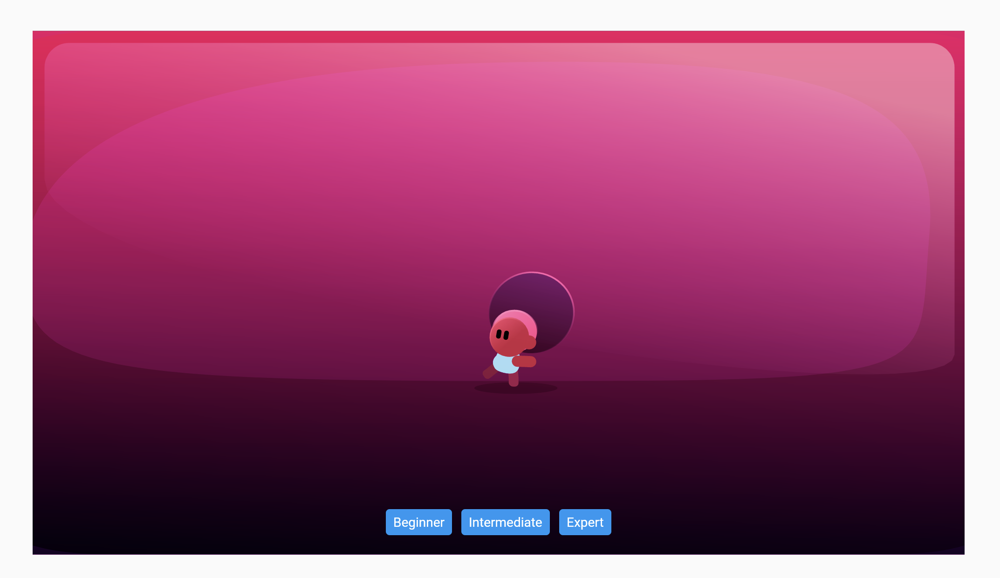

# Tutorials App

    
## Flutter App

Rive example. Change the values according with your rive animation:

    String path = '../lib/rive/assets/skills.riv';
    String animationName = 'Designer\'s Test2';
    String inputButton = 'Level';

The "_levelInput?.value = 0" need be changed according with input of the rive animation.